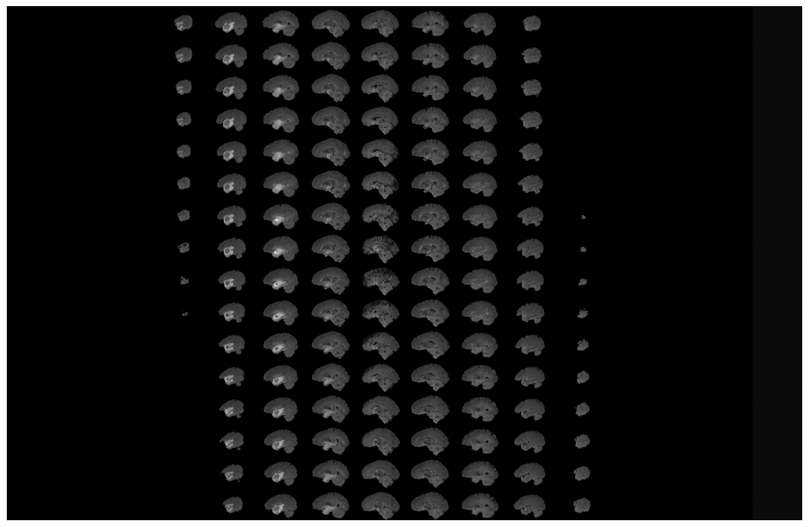

# 🧠 Evaluating the Effect of Multimodal MRI Channels on Automated 3D Glioma Segmentation using 3D U-Net

> A deep learning-based investigation on the effect of different MRI modality combinations for glioma brain tumor segmentation using a 3D U-Net architecture.



## 📌 Project Overview

This project focuses on **brain tumor segmentation** using the **BRaTS 2020 dataset**, employing various MRI modality configurations to evaluate their effectiveness:
- **Di-modal**: FLAIR + T1CE
- **Tri-modal**: FLAIR + T1CE + T2
- **Quad-modal**: FLAIR + T1CE + T2 + T1

The core idea is to **assess whether more input modalities lead to better segmentation results** or if redundancy introduces noise that affects performance.

All implementation, preprocessing, training, and evaluation are contained in **a single Jupyter notebook** for simplicity and reproducibility.

---
## 📁 Repository Structure

The repository is organized as follows:
- ├── TMod_UNET.ipynb # Main Jupyter notebook containing preprocessing, training, and evaluation
- ├── /logs/ # Directory to store training logs and performance metrics
- ├── /media/ # A library which contains the videos and the photos
- └── README.md # Project documentation and usage instructions (this file)

> ✅ **Note:**  
> - All experiment variants (Di-modal, Tri-modal, Quad-modal) are handled inside `TMod_UNET.ipynb`.  
> - Trained models and logs are automatically saved into their respective folders after each training session.
---

## 🗂️ Dataset Access

The notebook is designed to work with the **BRaTS 2020 dataset**, which provides multi-modal MRI scans and segmentation ground truth labels.

### ⚠️ How to Access the Dataset:

The dataset can be downloaded from:
- Official BRaTS website: [BRaTS Challenge](https://www.med.upenn.edu/cbica/brats2020/data.html)  
OR  
- Kaggle (Larxel repository):  
```bash
!kaggle datasets download andrewmvd/brain-tumor-segmentation-in-mri-brats-2015
```
#### 🟢 Steps to Obtain Kaggle API Token:
1. Create a Kaggle account at [https://www.kaggle.com/](https://www.kaggle.com/).
2. Go to **Account Settings** → **API** → Click **"Create New API Token"**.
3. A file named `kaggle.json` will be downloaded.
4. Upload the `kaggle.json` file to your environment (Google Colab / local machine).

> ✅ Example (for Google Colab):
```python
from google.colab import files
files.upload()  # Upload kaggle.json
```

## 🔗 Notebook Access

Due to GitHub file size restrictions, the notebook is hosted externally:

[Download/View the Notebook (Google Drive)](https://drive.google.com/drive/folders/1quu60iwUaEvBv8AnqJr00c0OvEIRgbh6?usp=drive_link)


